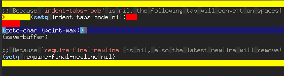

Delete Needless Spaces
======================

Emacs: removing the unnecessary spaces from your buffers.



Intro
-----
Delete Needless Spaces is a smart minor mode that keep clean our buffers from silly spaces. It's enabled by default for all new and already clean buffers but, if you visit a dirty file, it disables itself.

When this minor mode is enabled (implicitly for clean buffers and explicitly on dirty buffers with `M-x delete-nl-spaces-mode`), before a buffers it's saved to its files this mode:

* deletes initial blank lines;
* changes spaces on tabs or vice versa depending on `indent-tabs-mode`;
* deletes the trailing whitespaces and empty last lines;
* deletes also latest blank line if `require-final-newline` is `nil`;

Installation
------------
Copy the file in a directory which is in the Emacs `load-path`. Then, execute the following code either directly or in your .emacs file:
```lisp
;;; Deleting needless spaces before saving buffers.
(require 'delete-nl-spaces)
```
